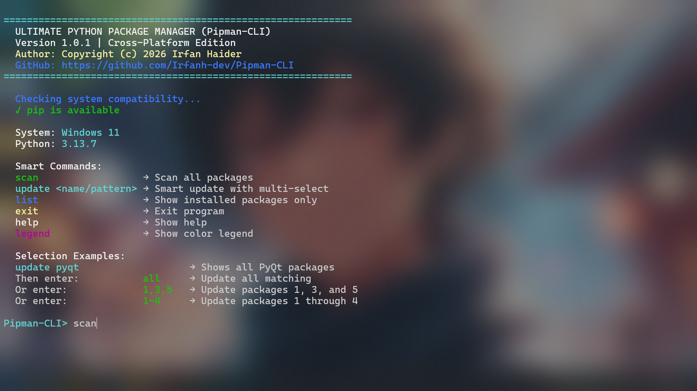
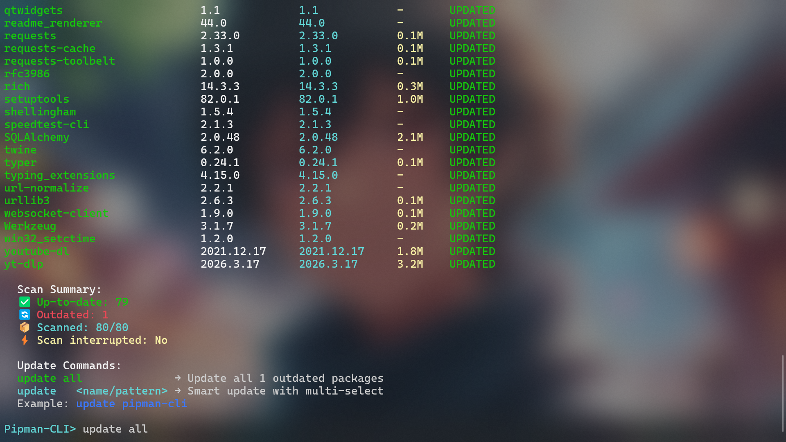

# Pipman-CLI ( Ultimate Python Package Manager) By Irfan  

A powerful, cross-platform command-line tool for managing **Python packages** with **`intelligent scanning`**, **`smart updates`**, and **`beautiful terminal output`**. Manage your Python packages like a pro — without memorizing a single command.

> *The last package manager command you'll need to learn.*
 
 


## ✨ Features

* **Intelligent Scanning:** Fast, concurrent package scanning with real-time progress tracking.
* **Smart Updates:** Supports fuzzy matching and multi-select package updates for maximum efficiency.
* **Modern Terminal GUI:** Features a colorful ANSI-coded interface so managing packages won't feel static or boring.
* **Batch Operations:** Update multiple specific packages or entire ranges (e.g., 1-4) in one go.
* **Cross-Platform:** Works 100% on Windows, macOS, and Linux.
* **Interactive Mode:** User-friendly CLI with loading animations and interruptible scans.

## 🖼️ Preview




## 🚀 Installation

**Via PyPI (Recommended):**
```bash
pip install pipman-cli
```

**Via GitHub (Manual):**
1. Download or clone this repo
2. Navigate to the folder
3. Run:
```bash
pip install -e .
```
Once installed, launch with:
```bash
pipmancli
```
## 📦 How to Use

### Available Commands

| Command | Description |
|---------|-------------|
| scan | Scan all installed packages for updates  |
| update <name/pattern> | Smart update with fuzzy matching |
| list | Show all installed packages |
| help | Display available commands |
| legend | Show color legend |
| exit | Exit the program |


**Instructions;**     
**1.** type `scan` to scan the packages installed on your system.    
**2.** type `legend` to understand what each color means.   
**3.** type `update all` to update all out updated libraries.     
**4.** type `update {package_name}`  to update specific one. (e.g. update ytdlp)    
**5.** type `update {pkg1}, {pkg2}, {pkg3}, {nth}` to install multiple at once
## ⚙️ Development & Technology

This tool is built for speed and reliability using:

* **Python 3.6+:** The core engine for package management.
* **Requests Library:** Handles version checking and dependency data.
* **Subprocess & Threading:** Powers the concurrent scanning and background tasks.
* **ANSI Styling:** For the attractive, color-coded terminal interface.


## 🐛 Issues & Support

If you encounter any issues or have suggestions:

1. Check the [Issues](https://github.com/Irfanh-dev/pipman-cli/issues) page
2. Create a new issue with detailed information
3. Include your Python version, OS, and error messages


# 📜  [](LICENSE)


* This project is open source and distributed under the **MIT License**.

---

Made with 💙 by [Irfan](https://github.com/Irfanh-dev) — 🚀 Check my profile for more upcoming projects! 
